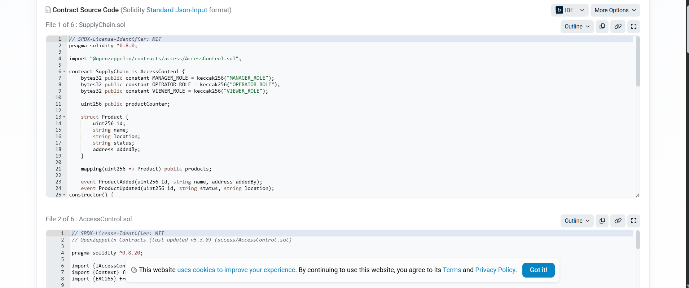
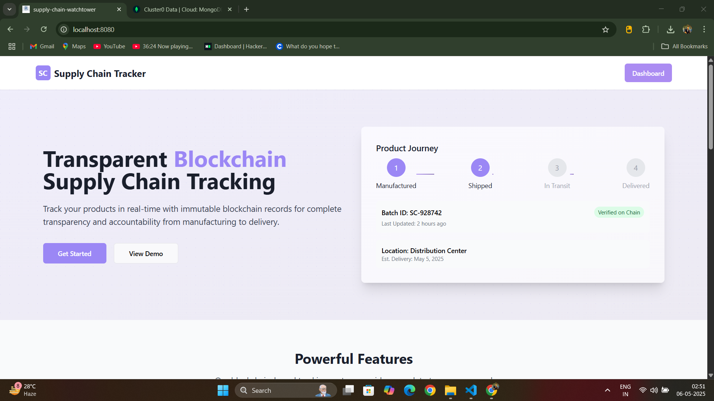
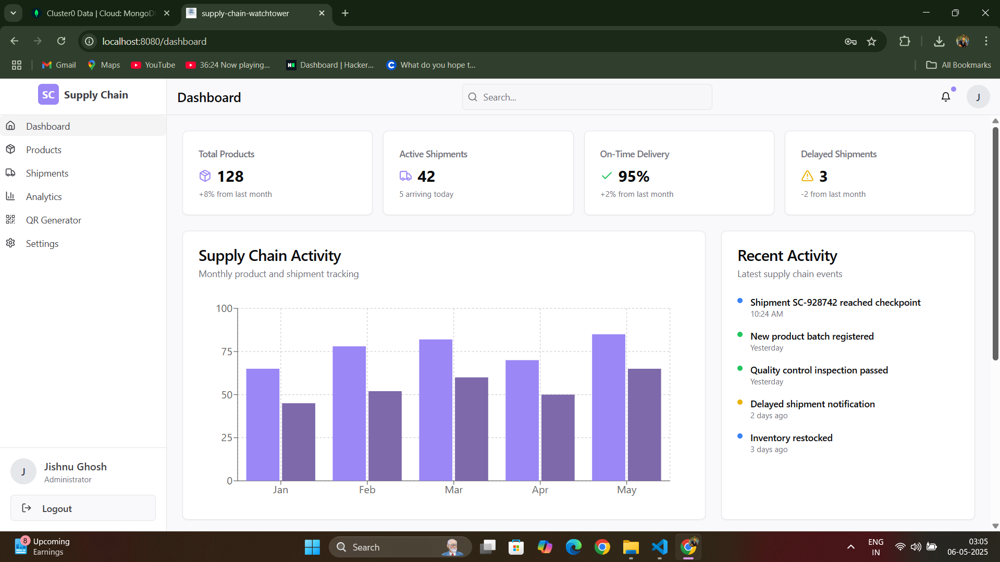
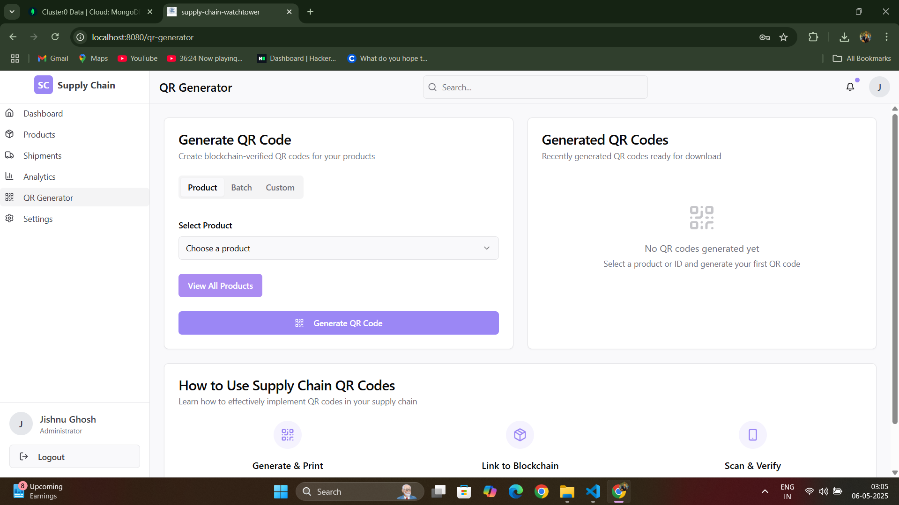
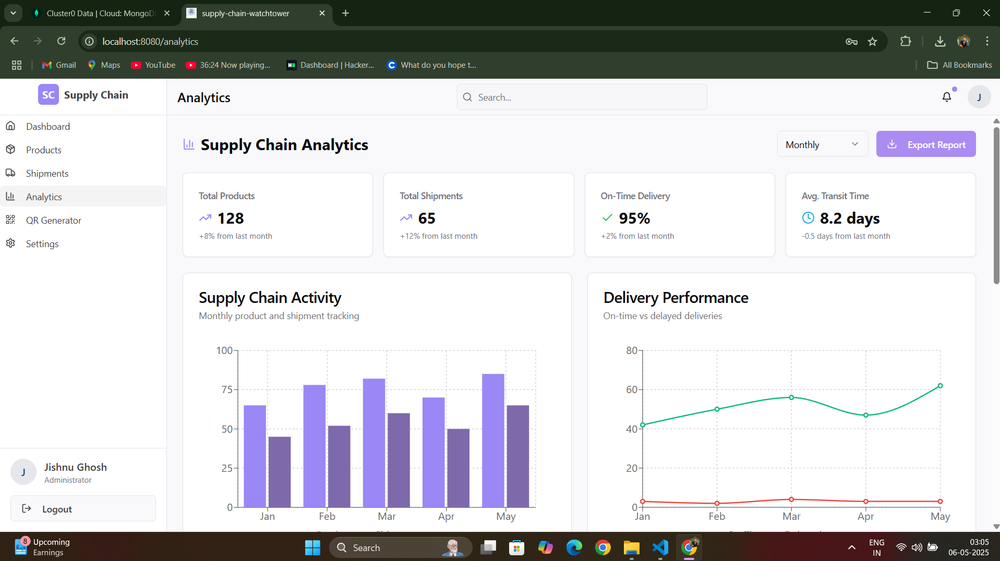

# 📦 SupplyChain Blockchain Solution

A robust and decentralized **Supply Chain Management** solution built using **Golang** and **Solidity**.  
This project streamlines operations, ensures transparency, and leverages blockchain technology to revolutionize logistics and asset tracking.

---

## 🚀 Features

- ✅ Decentralized Supply Chain Tracking
- ✅ Smart Contracts with **Solidity**
- ✅ Backend services powered by **Golang**
- ✅ Transparent and tamper-proof records
- ✅ Modular architecture for easy scaling
- ✅ Ready for integration with logistics partners

---

## 🛠️ Tech Stack

- **Golang** — Backend API & business logic
- **Solidity** — Smart contracts on Ethereum blockchain
- **Hardhat** — For smart contract development and testing
- **PostgreSQL / MongoDB** — (Optional) For off-chain storage
- **Docker** — Containerized deployment

---

## 📦 Installation

### 1. Clone the Repo

```bash
git clone https://github.com/yourusername/supplychain-golang-solidity.git
cd supplychain-golang-solidity
```

### 2. Setup Smart Contracts
```
cd blockchain
npx hardhat compile

```

### 3.  Run Golang Backend
```
cd Serverside
go mod supplychain
go run main.go

```

### 4. 📝 Usage
- Deploy smart contracts with Hardhat

- Connect backend Golang APIs with smart contracts

- Integrate with your frontend or logistics dashboard

- Track and manage assets across the supply chain


### 5. 📄 Smart Contract Structure
- SupplyChain.sol: Handles asset creation, tracking, and transfer between participants

### 6. 🤝 Contributing

Pull requests are welcome!
For major changes, please open an issue first to discuss what you would like to change.
Steps to contribute:

- Fork the repository

- Create your feature branch (git checkout -b feature/YourFeature)

- Commit your changes (git commit -m 'Add some feature')

- Push to the branch (git push origin feature/YourFeature)

- Open a pull request

### 7. 🙌 Acknowledgements
- Inspired by global supply chain challenges

- Built with ❤️ using Golang and Solidity









